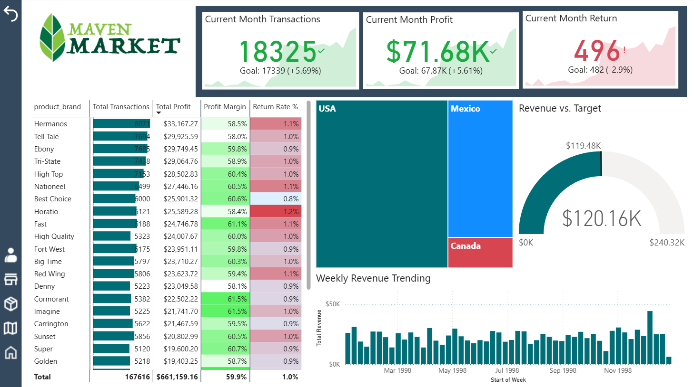
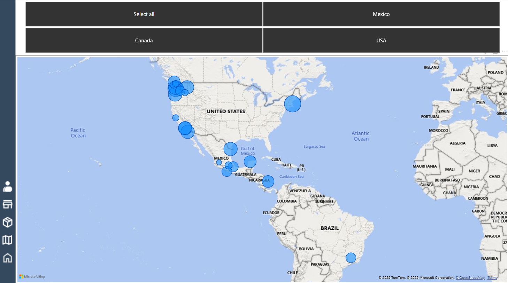
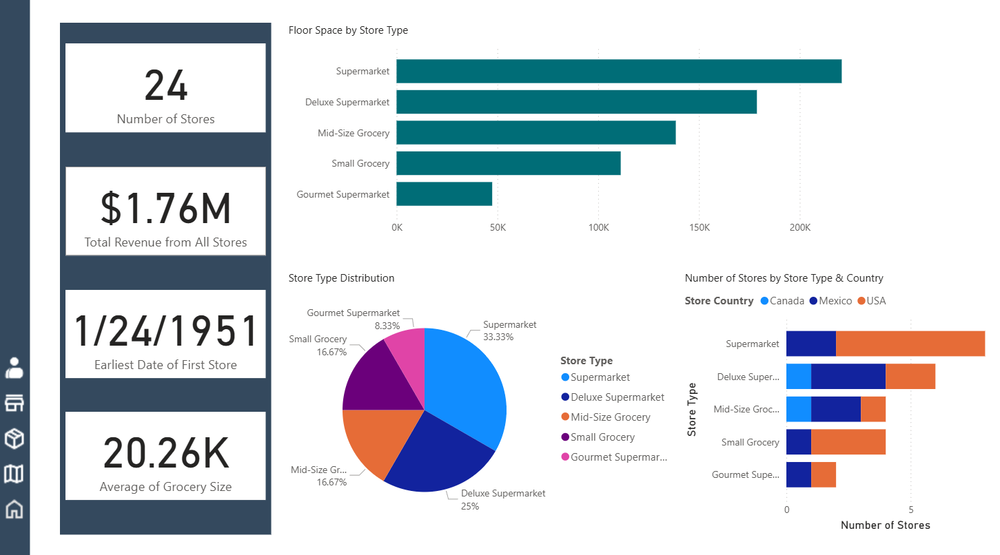
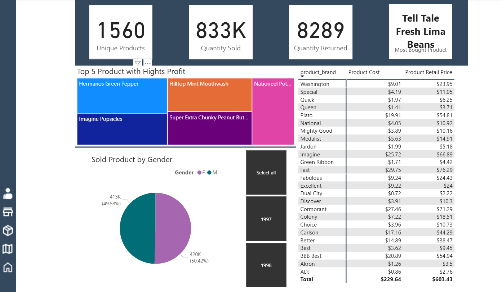
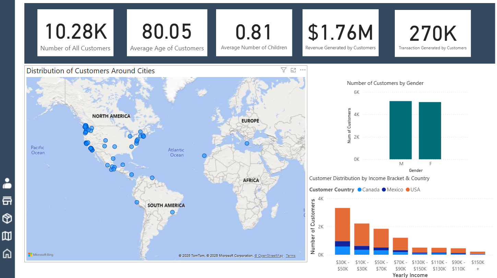

# 🛒 Maven Market Analysis Dashboard

## 📌 Project Overview
This project is part of a **Power BI course**, where I worked as a **Business Intelligence Analyst** for **Maven Market**, a multinational grocery chain with locations in **Canada**, **Mexico**, and the **United States**.  

The goal was to transform a set of **raw CSV files** into a fully interactive **Power BI dashboard** to help management track store, product, and customer performance, and uncover business opportunities.  

**Note:** This was a practice project completed during the Power BI course.

---

## 🎯 Project Brief
The management team needed a way to:
- Track **KPIs**: revenue, profit, transactions, and product performance
- Compare **store performance** across regions and countries
- Analyze **product-level trends** and top performers
- Understand **customer demographics and distribution**

The only data provided was a **folder of raw CSV files** containing:
- Stores  
- Products  
- Customers  
- Regions  
- Transactions  
- Calendar  

---

## 🛠 Tools & Technologies
- **Power BI Desktop**
- **DAX** (Data Analysis Expressions)
- **Power Query**
- Relational Data Modeling

---

## 📂 Steps & Methodology
1. **Data Connection & Transformation**  
   - Imported multiple CSV files into Power BI  
   - Cleaned and shaped the data using Power Query  
   - Standardized formats for dates, currencies, and categories  

2. **Data Modeling**  
   - Built a relational data model (star schema)  
   - Connected fact tables (transactions) with dimension tables (products, stores, customers, regions)  

3. **Calculations**  
   - Created DAX measures for KPIs like total revenue, total profit, transactions, and profit margin  
   - Built calculated columns for product categories, customer age groups, and store metrics  

4. **Dashboard Design**  
   - Created separate report pages for **Executive Overview**, **Product Analysis**, **Store Performance**, and **Customer Insights**  
   - Used slicers, buttons, and bookmarks for interactivity  

---

## 📊 Dashboard Features
- **KPI Cards**: Revenue, Profit, Transactions, Profit Margin  
- **Regional Performance Map** (Store & Customer Locations)  
- **Top Products by Profit & Sales**  
- **Weekly and Monthly Trend Analysis**  
- **Customer Segmentation** (Gender, Age Group, Income Bracket)  
- **Store Type & Country Comparison**

---

## 📸 Screenshots 
 

  
  
  

---

## 📂 How to View the Project
1. Download the `.pbix` file from this repository  
2. Open it using **[Power BI Desktop](https://powerbi.microsoft.com/desktop/)** (Free)  

---

## 🧠 Key Learnings
- Data cleaning and transformation in **Power Query**
- Building a **relational data model** for multiple fact & dimension tables
- Writing **DAX** measures for KPI tracking
- Designing effective and interactive **Power BI dashboards**
- Applying storytelling principles to data visualization

---

## 📌 Data Source
This dataset is provided as part of the **Maven Market** project in a Power BI course.  
The dataset simulates real-world retail operations for a multinational grocery chain.

---

**Author:** *Mohammad Jameel Abdelqader*  
**Date:** *August 2025*
